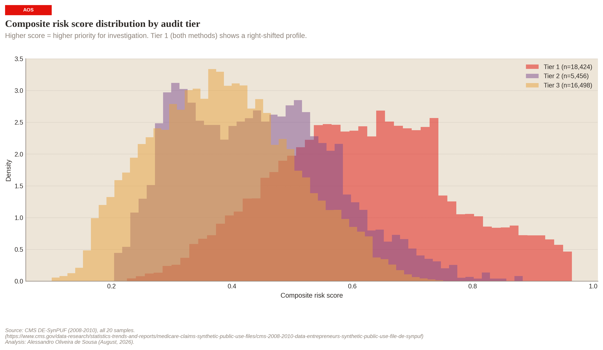

# Provider Aberrant Billing Pattern Detection

[]([https://medium.com/@alessandro.oof/detecting-medicare-phantom-billing-at-scale-building-a-post-mortem-claims-impossible-service-day-c8d57a6b9c3c](https://medium.com/@alessandro.oof/detecting-aberrant-medicare-billing-patterns-a-multi-method-framework-using-synthetic-cms-data-5660d71e2839))
[](https://linkedin.com/in/aosousa)
[](https://github.com/sousa-a/medicare-upcoding-unbundling-engine)
[](https://github.com/sousa-a/medicare-phantom-billing-engine)

---

**Aberrant Billing Detection on CMS DE-SynPUF Medicare Claims**

---

**Project P3** - Part of a three-project Medicare Fraud, Waste & Abuse (FWA) portfolio.

> **The methods transfer to real claims data. The specific dollar estimates and provider flags do not.** This project uses CMS DE-SynPUF synthetic data to demonstrate an end-to-end aberrant billing detection framework - the analytical pipeline is production-grade, but the numbers are proof-of-concept.



*Tier 1 providers (flagged by both z-scores and Isolation Forest) concentrate in the high-risk tail. The separation between tiers confirms the two-gate framework produces operationally distinct risk profiles.*

---

## What this project does

Identifies Medicare providers whose billing patterns deviate significantly from their peers, using two independent detection methods and a cross-method validation framework that classifies providers into actionable audit tiers.

The output is a **triage system** for a Special Investigations Unit (SIU) - it generates investigation leads, not fraud determinations. This distinction matters: without adjudicated fraud labels, the system detects *statistical aberrance*, which is the starting point for every real-world FWA investigation.

### Detection methods

| Method | Approach | What it catches |
|---|---|---|
| **Peer-group z-scores** | Within-specialty statistical outliers (conjunction rule: ≥2 metrics at \|z\|>2.0) | Providers extreme on individual billing dimensions vs. clinical peers |
| **Isolation Forest** | Global multivariate anomaly detection (unsupervised, distribution-free) | Providers occupying unusual positions in the full feature space - unusual *combinations* even when no single metric is extreme |

### Two-gate confidence matrix

The core analytical output classifies providers by the *intersection* of both methods:

| Tier | Criteria | Action |
|---|---|---|
| **Tier 1 - High confidence** | Flagged by BOTH z-score AND IF | Immediate audit & record request |
| **Tier 2 - IF multivariate** | Flagged by IF only | Complex unbundling/interaction review |
| **Tier 3 - Z-score statistical** | Flagged by z-score only | Single-metric policy limit enforcement |
| Unflagged | Neither method | Routine monitoring |

Cohen's κ = 0.60 between methods - moderate agreement indicating shared signal with independent contributions. If κ were ~1.0, the methods would be redundant; if ~0, they'd be measuring different phenomena entirely.

---

## Technology stack

This project deliberately implements the same analytical pipeline across three technology stacks:

| Layer | Technology | Role |
|---|---|---|
| **Data warehouse** | Snowflake (SQL) | Dimensional modeling, data quality checks, initial z-score computation |
| **Cross-validation** | SAS | PROC STDIZE + PROC RANK for independent z-score validation |
| **Detection & triage** | Python / DuckDB | HCPCS-level peer groups, Isolation Forest, concordance analysis, composite scoring, case file generation |

**Why three stacks?** In production, a single stack would be selected based on organizational infrastructure. The multi-stack approach here demonstrates:

1. Proficiency across the technologies most commonly found in US healthcare FWA operations.
2. The ability to reconcile outputs across independent implementations (Python vs. Snowflake κ = 0.26, reflecting deliberate methodology improvements - HCPCS-level peer groups, conjunction rule, MIN_CLAIMS raised from 5→30 - not bugs).
3. That the analytical logic is technology-agnostic: the same peer-group z-score concept produces consistent results whether implemented in SQL, SAS, or Python.

---

## Repository structure

```
provider-aberrant-billing-detection/
│
├── notebooks/
│   ├── 01_data_profiling.ipynb             # Data quality, completeness, cardinality
│   ├── 02a_peer_group_construction.ipynb   # HCPCS-level peer groups, MIN_CLAIMS
│   ├── 02b_zscore_flagging.ipynb           # Within-peer z-scores, conjunction rule
│   ├── 03_isolation_forest.ipynb           # Multivariate anomaly detection
│   ├── 04_cross_method_validation.ipynb    # Two-gate matrix, concordance, divergence
│   └── 05_business_impact_case_files.ipynb # Triage, composite scores, case files
│
├── snowflake/
│   ├── 01_create_schema.sql
│   ├── 02_load_desynpuf.sql
│   ├── 03_data_quality.sql
│   ├── 04_dim_provider.sql
│   ├── 05_billing_metrics.sql
│   └── 06_zscore_flags.sql
│
├── sas/
│   ├── 01_data_load.sas
│   ├── 02_peer_comparison.sas
│   └── 03_flag_export.sas
│
├── src/
│   ├── config.py                # Thresholds, paths, constants - no magic numbers
│   ├── visual_identity.py       # Publication-quality chart styling
│   └── data_loader.py           # Snowflake export loader
│
├── outputs/
│   ├── figures/                  # All charts (300 DPI, publication-ready)
│   └── case_files/               # Markdown investigation briefs
│
└── data/
    └── snowflake_exports/        # CSVs from Snowflake queries
```

---

## Key analytical decisions

| Decision | Choice | Rationale |
|---|---|---|
| MIN_CLAIMS | 30 (using `total_claims`, not `total_lines`) | Excludes low-volume providers where z-scores are unreliable |
| Peer grouping | HCPCS-level (top billed code) | More homogeneous than broad specialty; reduces false flags from cross-specialty comparisons |
| Z-score flagging | Conjunction rule (≥2 metrics at \|z\|>2.0) | Reduces single-metric noise; requires multi-dimensional aberrance for a flag |
| IF contamination | 0.05 (sensitivity analysis at 0.03–0.15) | Analyst-set parameter, not learned - in production, calibrated against investigation hit rates |
| Composite weights | 30% z-score, 30% IF, 30% excess, 10% peer group | Equal weighting across signals; no empirical basis for differential weighting without outcome labels |
| Naming | "Aberrant billing" not "fraud" | No ground truth labels - the system detects statistical deviations, not proven fraud |

---

## Limitations

### Synthetic data

DE-SynPUF was designed by CMS for educational purposes. The synthesis process introduces distortions that specifically affect aberrant billing detection:

- **Noise injection** on continuous variables compresses the extreme tails where aberrant billing lives.
- **Distribution truncation** limits the outliers we are trying to detect.
- **Scrambled beneficiary-provider linkages** mean utilization metrics (`lines_per_beneficiary`, `claims_per_beneficiary`) reflect manufactured relationships.
- **Homogeneous tails** - the top Tier 1 providers show suspiciously uniform profiles (avg paid ~$44–45, HHI ~0.068), an artifact of the synthesis process.

**What transfers:** The framework (peer-group z-scores → Isolation Forest → two-gate concordance → composite scoring → tiered triage).  
**What does not:** Specific dollar estimates, provider flag counts, and case files.

### Methodological

- The Isolation Forest contamination parameter (0.05) is a design choice, not a discovery - the model flags 5% because we told it to.
- Excess billing uses the peer median as baseline. Small or homogeneous peer groups can produce unstable baselines (mitigated by MIN_PEER_GROUP_SIZE = 10).
- Derived specialty uses a HCPCS-based proxy. In production, NPPES taxonomy would provide real provider specialty.

### What a production system would add

- NPPES taxonomy for real provider specialty classification
- Historical investigation outcomes to calibrate thresholds via feedback loop
- Temporal modeling (month-over-month billing trajectories)
- Network analysis (shared-beneficiary graphs for provider ring detection)
- Geographic adjustment (GPCI normalization for regional payment variation)

---

## Data source

CMS DE-SynPUF (2008–2010), all 20 samples.  
[CMS DE-SynPUF documentation](https://www.cms.gov/data-research/statistics-trends-and-reports/medicare-claims-synthetic-public-use-files/cms-2008-2010-data-entrepreneurs-synthetic-public-use-file-de-synpuf)

---

## Related projects

This is part of a three-project FWA portfolio:

| Project | Focus | GitHub | Medium |
|---|---|---|---|
| P1 | Upcoding & unbundling detection | https://github.com/sousa-a/medicare-upcoding-unbundling-engine | https://medium.com/@alessandro.oof/detecting-medicare-fraud-at-scale-building-an-upcoding-unbundling-detection-engine-on-230-4de555db568d |
| P2 | Phantom billing detection | https://github.com/sousa-a/medicare-phantom-billing-engine | https://medium.com/@alessandro.oof/detecting-medicare-phantom-billing-at-scale-building-a-post-mortem-claims-impossible-service-day-c8d57a6b9c3c |
| P3 | Provider aberrant billing pattern detection | https://github.com/sousa-a/provider-aberrant-billing-detection | https://medium.com/@alessandro.oof/detecting-aberrant-medicare-billing-patterns-a-multi-method-framework-using-synthetic-cms-data-5660d71e2839 |

These projects used data from CMS 2008-2010 Data Entrepreneurs’ Synthetic Public Use File (DE-SynPUF).<br>
https://www.cms.gov/data-research/statistics-trends-and-reports/medicare-claims-synthetic-public-use-files/cms-2008-2010-data-entrepreneurs-synthetic-public-use-file-de-synpuf

---

## Author

**Alessandro Oliveira de Sousa**  
August 2026
